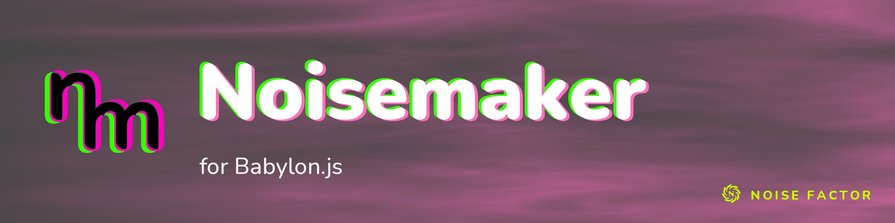

<!-- repo-hero -->
<a href="https://noisemaker.app/"></a>

<sub>Open source from <a href="https://noisefactor.io">Noise Factor</a> &middot; <a href="https://github.com/noisefactorllc">more projects</a></sub>

# Noisemaker for Babylon.js

Current measured support: [compatibility report](docs/COMPATIBILITY.md).

> Run **Noisemaker**'s procedural visuals in **Babylon.js**.

> This package supports the "Export Shader Pipeline" feature in Noisedeck.app. The
> feature runs shader compositions on other platforms. Noise Factor derives this package
> from the upstream Noisemaker Engine project and tests it for pixel-level parity.

## What is this?

**Noisemaker** is a procedural visual engine. You write tiny text programs — chains of
effects — and it renders live, animated GPU textures:

```
search synth, filter
noise(scaleX: 60).bloom().write(o0)
render(o0)
```

That little language is Noisemaker's **DSL** (a domain-specific language for visuals). The original
engine runs in the browser at [noisedeck.app](https://noisedeck.app).

**Noisemaker for Babylon.js** runs that same engine inside **Babylon.js** — the same programs and the same
~210 effects, rendered as part of a Babylon scene. Use it to make textures, materials, skyboxes, and
animated backgrounds from code, with no image files.

Babylon.js is JavaScript over WebGL2/WebGPU — the exact environment Noisemaker already targets — so
**nothing is translated**. This port runs the **published engine as-is** and adds two small pieces:
a `BabylonBackend` (the Backend-interface impl) and a `NoisemakerRenderer` host that exposes the
result as a Babylon texture.

## What you can do with it

- **Generate animated textures** from a short program — noise, gradients, patterns, color grades,
  blurs, warps.
- **Run simulations on the GPU** — particle/agent systems (flocking, slime/physarum, diffusion) and
  fluid (navier–stokes).
- **Render 3D volumes and bake cubemaps** — raymarched noise volumes, skyboxes, PBR reflections.
- **Use the result anywhere a Babylon texture goes** — materials, skyboxes, reflections, backgrounds.

## Requirements

- **Node.js + npm** — to fetch the engine and run the tooling.
- **`@babylonjs/core` v9** — a peer dependency (your host app provides it).
- **A WebGL2 environment** — a browser; the parity tests run headless via Playwright / Chromium.

## Install

The engine itself is **not committed** to this repo. `vendor/fetch.sh` downloads the published
distribution from the CDN (`shaders.noisedeck.app`) into a git-ignored `vendor/`, like `node_modules`.
Only the fetch script is committed. Never commit the downloaded bytes.

```bash
npm install            # @babylonjs/core (peer) + dev tooling
bash vendor/fetch.sh   # fetch the published engine into vendor/noisemaker/ (gitignored)
```

## Your first render

First, turn a DSL program into a runnable **fat graph** (the render graph with shader source
attached):

```bash
node tools/export-fat-graph.mjs "search synth
noise(seed: 1, scaleX: 30, colorMode: 1, speed: 25).write(o0)
render(o0)" demo.fatgraph.json
```

Then load the graph. Render a frame:

```js
import { Engine } from '@babylonjs/core/Engines/engine.js'
import { Pipeline } from './vendor/noisemaker/noisemaker-shaders-core.esm.js'
import { NoisemakerRenderer } from './src/runtime/renderer.js'
import fatGraph from './demo.fatgraph.json'

const engine = new Engine(canvas, true)
const nm = new NoisemakerRenderer(engine, { Pipeline, size: 512 })
await nm.loadGraph(fatGraph)
nm.renderFrame(0)              // render one frame at normalized time 0
```

**Every DSL program** has the same shape:

- Name the namespaces it uses (`search synth, filter`).
- Chain the effects.
- Write the result to an output surface (`.write(o0)`).
- Select a surface to show (`render(o0)`).

## Use it in your own Babylon project

> **Install into your own project.** This package isn't published to npm yet. Until it is, install
> it from git — `npm i github:noisefactorllc/noisemaker-for-babylonjs` — or copy `src/runtime/` into
> your app. Run `vendor/fetch.sh` to download the engine. The snippets here import the renderer by
> its in-repo path (`./src/runtime/renderer.js`). The demos in `examples/` import it as
> `../src/runtime/renderer.js`.

`NoisemakerRenderer` keeps a stable output texture that you can assign to any material. It updates
the effect each frame:

```js
// Use the live output as a texture on any material:
const tex = new Texture(null, scene)
tex._texture = nm.outputInternalTexture
material.diffuseTexture = tex

engine.runRenderLoop(() => { nm.renderFrame(t); scene.render() }) // t normalized 0..1
```

Bake a composition into a cube texture for a skybox or PBR reflection:

```js
const { cubeTexture } = await nm.renderCubemap({ size: 512 })
// wrap cubeTexture in a Babylon CubeTexture for scene.reflectionTexture / a skybox
```

Two runnable demos (`node examples/build.mjs`, then open the HTML):

- **`examples/index.html`** — a Noisemaker effect as a live texture on a spinning box.
- **`examples/cubemap.html`** — a baked Noisemaker cubemap as a skybox + reflective sphere.

## What works today

Every claim below is bound to machine-re-derivable evidence in
[`parity/coverage-map.json`](parity/coverage-map.json) (generated by
`node tools/coverage-map.mjs` and re-asserted by `test/coverage-map.test.js`): each catalogued
effect is bound to its graded fixture programs, and skipped/refused cases are retained in the
counts rather than dropped. The acceptance rule for "works" is the sweep's byte-exact gate
(max-abs-diff 0, SSIM ≥ 0.999) against the reference backend rendered through the same vendored
engine in the same pass.

- **The whole effect catalog** — all 210 effects (`tools/catalog.mjs`) — has at least one graded
  parity fixture each (329 roster programs with goldens at this tree = the 325 committed-ledger
  programs — the full roster plus the mode matrix at the last full-roster ledger grade: 322 PASS,
  3 documented external-input fallback skips, 0 FAIL — plus the 4 GAP-004 real-input fixtures,
  graded in [`parity/external-input-grades.json`](parity/external-input-grades.json)).
  Byte-identical to the web reference **when golden and candidate are minted in the same pass on
  the same driver** (the candidate runs on the same WebGL2 driver as the reference, so the match
  is exact — no rounding tolerance). Cross-driver and cross-machine re-grades are a documented
  exception: committed goldens drift a documented ±1 on other drivers, and heavy evolve programs
  need a stable long-session runner (see STATUS.md known limits).
- **Every mode of every artistic filter**, not just its default — a 101-row (effect, mode)
  matrix across 19 effects, each graded byte-exact. See [STATUS.md](STATUS.md) for the full
  matrix. This is representative coverage, not the full parameter-interaction Cartesian product:
  ~257 choice-bearing parameters across 132 effects (~1,460 named choices at engine 1.0.185) are
  schema counts, **explicitly not a tested combination count**.
- **Particle/agent sims and fluid (navier–stokes)** render and match the reference, evolved to a
  bit-identical steady state (~30 s per program via the `EVOLVE` map) — including the perspective
  camera mode and depth-sorted/defocus billboard rendering.
- **3D-volume raymarch, landscape rendering, and cubemap bake** render and match — usable as
  Babylon skyboxes / PBR reflections.
- **The live NoiseBLASTER! corpus** — the historical denominator is 40 raw compositions, 39
  gradeable + 1 the reference compiler itself rejects (counts retained; the raw art is a
  local-only fixture and is not committed). A 2026-09-26 live-feed refetch classified 20/20
  current compositions as reference-compileable; the full re-grade of a fresh corpus remains an
  open, recorded exclusion (same-pass 1800-frame evolution per composition — needs a stable
  long-session runner).
- **All four external-input effects work through their real host-input path**, byte-identical on
  both backends with deterministic host fixtures recorded in
  [`parity/external-input-grades.json`](parity/external-input-grades.json): `media` (host image
  upload, 161×97), `text` (host overlay-canvas upload), `roll` (the engine's own `MidiState` fed
  through the real MIDI note-grid path), and `meshLoader` (the engine's own OBJ parser/packer
  feeding the host-uploaded mesh surfaces). The no-input fallback programs (`media`, `text`,
  `roll`) stay policy-skipped in `parity/sweep.sh` by design — a fallback pass is necessary, not
  sufficient, evidence — and those skipped cases are retained in the ledger and the coverage map.

Coverage table, parity numbers, and known limits: **[STATUS.md](STATUS.md)**.

Current audit gaps: **[docs/COMPLETION_GAPS.md](docs/COMPLETION_GAPS.md)**.

## How it works

Noisemaker turns a DSL program into a **render graph** — a normalized list of GPU passes. That graph
is the shared seam every Noisemaker port targets. This port goes one level deeper: it reuses the
published compiler and `Pipeline` unchanged and adds a **`BabylonBackend`** that satisfies the
engine's `Backend` interface, so the unchanged `Pipeline` runs on `@babylonjs/core`. The effect
shaders are GLSL ES 3.00, used as-is.

→ **[ARCHITECTURE.md](ARCHITECTURE.md)** (how it maps onto Babylon) ·
**[PORTING-GUIDE.md](PORTING-GUIDE.md)** (backend notes + engine quirks).

## Contributing

The port consumes the published engine, so it needs nothing else checked out. The **dev/parity
tooling** renders both the reference goldens and the Babylon candidates through that same vendored
engine (only the backend differs), so a same-engine diff is exact:

```bash
npm install && bash vendor/fetch.sh    # deps + fetch the published engine (gitignored)
python3 -m venv parity/.venv && parity/.venv/bin/pip install numpy pillow   # compare.py deps
npx playwright install chromium        # headless browser for the candidate renders
bash parity/sweep.sh                    # candidates via BabylonBackend, graded against the committed goldens
bash parity/run.sh noise                # just one program
#   -> [PASS] noise: max-abs-diff=... (spot check; see the gate note below)
```

`parity/sweep.sh` compares against the committed goldens. It does not generate them.

**Command gates.** The commands enforce different gates — pick by claim:

- `bash parity/sweep.sh` grades at the **byte-exact acceptance policy: tolerance 0, SSIM ≥ 0.999**,
  over the current roster — **329 programs at this tree**: the 325 committed-ledger programs
  (322 PASS, 3 policy skips retained — the `media`/`text`/`roll` no-input fallbacks) plus the 4
  GAP-004 real-input fixtures, which are graded, not skipped. This is the gate behind every
  "byte-identical" claim. (325 is the retained `parity/ledger.json` artifact; 329 is what a
  fresh sweep grades.)
- `bash parity/corpus/sweep.sh` (live corpus, 1800-frame evolutions) and
  `bash parity/run.sh <name>` (single program) grade at a **relaxed spot-check gate: tolerance
  2.001, SSIM 0.98** (corpus: hardcoded in the script; run.sh: its defaults) to absorb
  cross-driver/cross-machine driver noise. A PASS at these gates is *not* byte-exact enforcement —
  the recorded corpus grades report the measured max-abs-diff per composition (byte-identical
  outcomes, recorded above), and for one roster program you can pass the strict gate explicitly:
  `bash parity/run.sh noise 0 0.999`.

Current counts and coverage denominators are machine-re-derivable: 210 catalogued effects
(engine v1.0.185, build `6a0af04d`), 210/210 bound in
[`parity/coverage-map.json`](parity/coverage-map.json) with skipped/refused cases retained;
[`parity/ledger.json`](parity/ledger.json) retains the v1.0.181-era full-roster grade verbatim
(322 PASS / 3 SKIP / 0 FAIL). STATUS.md's [verification-commands table](STATUS.md) lists every
command, its gate, and its denominator.

A few effects (`watercolor`, the chaotic iterative solvers) are sensitive to time/GPU-scheduling.
A golden generated hours apart from the candidate can show a spurious few-percent diff.
The two backends are byte-identical when generated together (see PORTING-GUIDE.md).
To check parity with new goldens, regenerate them immediately before the sweep:
```bash
NM_GOLDEN=1 node parity/render-batch.mjs $(ls parity/programs/*.dsl | xargs -n1 basename | sed 's/\.dsl$//' | grep -v '^corpus_')
bash parity/sweep.sh
```

→ **[STATUS.md](STATUS.md)** (coverage + parity results) · `reference/01–10` (engine specs shared
across all Noisemaker ports).

## Repo layout

```
src/runtime/babylonBackend.js   the Backend impl on @babylonjs/core
src/runtime/renderer.js         NoisemakerRenderer host (stable output texture for materials)
tools/export-fat-graph.mjs      DSL → runnable "fat graph" (compiler + GLSL attached)
vendor/fetch.sh                 fetches the published engine from the CDN (gitignored)
examples/                       Babylon scenes: effect-as-texture, cubemap skybox
parity/                         golden-image test harness + DSL programs + live corpus
reference/01–10                 engine specs shared across all Noisemaker ports
ARCHITECTURE.md  PORTING-GUIDE.md  docs/   design, porting notes, build plan
STATUS.md                       coverage table, parity results, known limits
```

## License

MIT (see [LICENSE](LICENSE)). Use of the Noisemaker and Noise Factor names in derivative products is
subject to the [Trademark Policy](TRADEMARK.md).

Copyright © 2026 Noise Factor LLC
