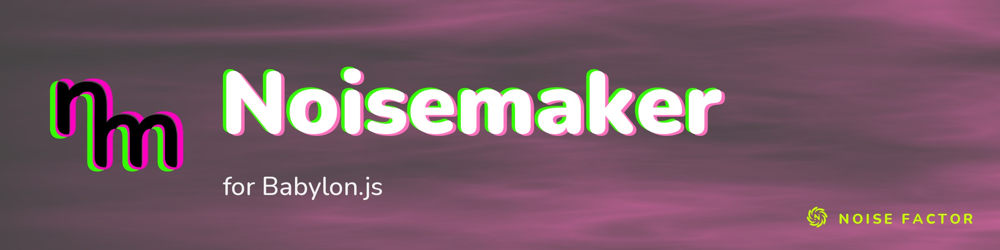

<!-- repo-hero -->
<a href="https://noisemaker.app/"></a>

<sub>Open source from <a href="https://noisefactor.io">Noise Factor</a> &middot; <a href="https://github.com/noisefactorllc">more projects</a></sub>

# Noisemaker for Babylon.js

> Run **Noisemaker**'s procedural visuals in **Babylon.js**.

> This package supports the "Export Shader Pipeline" feature in Noisedeck.app. The
> feature runs shader compositions on other platforms. Noise Factor derives this package
> from the upstream Noisemaker Engine project and tests it for pixel-level parity.

## What is this?

**Noisemaker** is a procedural visual engine. You write tiny text programs — chains of
effects — and it renders live, animated GPU textures:

```
search synth, filter
noise(scaleX: 60).bloom().write(o0)
render(o0)
```

That little language is Noisemaker's **DSL** (a domain-specific language for visuals). The original
engine runs in the browser at [noisedeck.app](https://noisedeck.app).

**Noisemaker for Babylon.js** runs that same engine inside **Babylon.js** — the same programs and the same
~210 effects, rendered as part of a Babylon scene. Use it to make textures, materials, skyboxes, and
animated backgrounds from code, with no image files.

Babylon.js is JavaScript over WebGL2/WebGPU — the exact environment Noisemaker already targets — so
**nothing is translated**. This port runs the **published engine as-is** and adds two small pieces:
a `BabylonBackend` (the Backend-interface impl) and a `NoisemakerRenderer` host that exposes the
result as a Babylon texture.

## What you can do with it

- **Generate animated textures** from a short program — noise, gradients, patterns, color grades,
  blurs, warps.
- **Run simulations on the GPU** — particle/agent systems (flocking, slime/physarum, diffusion) and
  fluid (navier–stokes).
- **Render 3D volumes and bake cubemaps** — raymarched noise volumes, skyboxes, PBR reflections.
- **Use the result anywhere a Babylon texture goes** — materials, skyboxes, reflections, backgrounds.

## Requirements

- **Node.js + npm** — to fetch the engine and run the tooling.
- **`@babylonjs/core` v9** — a peer dependency (your host app provides it).
- **A WebGL2 environment** — a browser; the parity tests run headless via Playwright / Chromium.

## Install

The engine itself is **not committed** to this repo. `vendor/fetch.sh` downloads the published
distribution from the CDN (`shaders.noisedeck.app`) into a git-ignored `vendor/`, like `node_modules`.
Only the fetch script is committed. Never commit the downloaded bytes.

```bash
npm install            # @babylonjs/core (peer) + dev tooling
bash vendor/fetch.sh   # fetch the published engine into vendor/noisemaker/ (gitignored)
```

## Your first render

First, turn a DSL program into a runnable **fat graph** (the render graph with shader source
attached):

```bash
node tools/export-fat-graph.mjs "search synth
noise(seed: 1, scaleX: 30, colorMode: 1, speed: 25).write(o0)
render(o0)" demo.fatgraph.json
```

Then load the graph. Render a frame:

```js
import { Engine } from '@babylonjs/core/Engines/engine.js'
import { Pipeline } from './vendor/noisemaker/noisemaker-shaders-core.esm.js'
import { NoisemakerRenderer } from './src/runtime/renderer.js'
import fatGraph from './demo.fatgraph.json'

const engine = new Engine(canvas, true)
const nm = new NoisemakerRenderer(engine, { Pipeline, size: 512 })
await nm.loadGraph(fatGraph)
nm.renderFrame(0)              // render one frame at normalized time 0
```

**Every DSL program** has the same shape:

- Name the namespaces it uses (`search synth, filter`).
- Chain the effects.
- Write the result to an output surface (`.write(o0)`).
- Select a surface to show (`render(o0)`).

## Use it in your own Babylon project

> **Install into your own project.** This package isn't published to npm yet. Until it is, install
> it from git — `npm i github:noisefactorllc/noisemaker-for-babylonjs` — or copy `src/runtime/` into
> your app. Run `vendor/fetch.sh` to download the engine. The snippets here import the renderer by
> its in-repo path (`./src/runtime/renderer.js`). The demos in `examples/` import it as
> `../src/runtime/renderer.js`.

`NoisemakerRenderer` keeps a stable output texture that you can assign to any material. It updates
the effect each frame:

```js
// Use the live output as a texture on any material:
const tex = new Texture(null, scene)
tex._texture = nm.outputInternalTexture
material.diffuseTexture = tex

engine.runRenderLoop(() => { nm.renderFrame(t); scene.render() }) // t normalized 0..1
```

Bake a composition into a cube texture for a skybox or PBR reflection:

```js
const { cubeTexture } = await nm.renderCubemap({ size: 512 })
// wrap cubeTexture in a Babylon CubeTexture for scene.reflectionTexture / a skybox
```

Two runnable demos (`node examples/build.mjs`, then open the HTML):

- **`examples/index.html`** — a Noisemaker effect as a live texture on a spinning box.
- **`examples/cubemap.html`** — a baked Noisemaker cubemap as a skybox + reflective sphere.

## What works today

CI checks every effect against the reference on every push. The same vendored engine renders each
parity program twice in one browser session, once through its own WebGL2 backend and once through
`BabylonBackend`, and the two images must match byte for byte (max-abs-diff 0, SSIM ≥ 0.999).
[`parity/coverage-map.json`](parity/coverage-map.json) (built by `node tools/coverage-map.mjs`,
re-checked by `test/coverage-map.test.js`) binds each effect to the programs that grade it.

- **The whole effect catalog**: all 210 effects have at least one graded parity program
  (329 programs in all).
- **Every mode of every artistic filter**, not just its default: a 101-row (effect, mode) matrix
  across 19 effects ([`parity/mode-coverage.json`](parity/mode-coverage.json)). This is
  representative coverage, not every combination of parameters.
- **Particle/agent sims and fluid (navier–stokes)** match after evolving ~30 s to a steady state
  (the `EVOLVE` map in `parity/render-batch.mjs`), including the perspective camera mode and
  depth-sorted/defocus billboard rendering.
- **3D-volume raymarch, landscape rendering, and cubemap bake** match, usable as Babylon skyboxes
  and PBR reflections.
- **All four external-input effects** match through their real host-input path, with
  deterministic host fixtures: `media` (host image upload), `text` (host overlay-canvas upload),
  `roll` (the engine's own `MidiState` fed through the MIDI note-grid path) and `meshLoader` (the
  engine's own OBJ parser and packer feeding the host-uploaded mesh surfaces). The no-input
  fallback programs of `media`, `text` and `roll` are skipped by policy and counted as skips in
  [`parity/ledger.json`](parity/ledger.json).
- **The live NoiseBLASTER! corpus**: `.github/workflows/corpus.yml` fetches the 20 most recent
  shared compositions on every push and grades each one, evolved 1800 frames, at the corpus
  gate (tolerance 2.001, SSIM 0.98).

## How it works

Noisemaker turns a DSL program into a **render graph** — a normalized list of GPU passes. That graph
is the shared seam every Noisemaker port targets. This port goes one level deeper: it reuses the
published compiler and `Pipeline` unchanged and adds a **`BabylonBackend`** that satisfies the
engine's `Backend` interface, so the unchanged `Pipeline` runs on `@babylonjs/core`. The effect
shaders are GLSL ES 3.00, used as-is.

→ **[ARCHITECTURE.md](ARCHITECTURE.md)** (how it maps onto Babylon) ·
**[PORTING-GUIDE.md](PORTING-GUIDE.md)** (backend notes + engine quirks).

## Contributing

Contributions follow the Noise Factor [contributing policy](https://github.com/noisefactorllc/.github/blob/main/CONTRIBUTING.md) and
[Code of Conduct](https://github.com/noisefactorllc/.github/blob/main/CODE_OF_CONDUCT.md). The notes below cover this repository's own tooling.

The port consumes the published engine, so it needs nothing else checked out. The parity
tooling renders both the reference goldens and the Babylon candidates through that same vendored
engine (only the backend differs), so a same-engine diff is exact:

```bash
npm install && bash vendor/fetch.sh    # deps + fetch the published engine (gitignored)
python3 -m venv parity/.venv && parity/.venv/bin/pip install numpy pillow   # compare.py deps
npx playwright install chromium        # headless browser for the candidate renders
NM_DUAL=1 bash parity/sweep.sh          # the CI gate: golden and candidate rendered in the same pass
bash parity/run.sh noise 0 0.999        # one program against its committed golden, strict gate
```

`parity/sweep.sh` grades at tolerance 0, SSIM ≥ 0.999 and writes `parity/ledger.json`. With
`NM_DUAL=1` it re-mints each golden in the same browser session as its candidate, which is what
CI does, so the result does not depend on the driver or on time-sensitive effects (`watercolor`,
the chaotic iterative solvers) drifting between runs. Without it, it grades against the
committed goldens in `parity/out/`, minted at the pinned engine. `parity/run.sh` and
`parity/corpus/sweep.sh` default to a relaxed spot-check gate (tolerance 2.001, SSIM 0.98) that
absorbs driver noise; a pass there is not byte-exact evidence.

After changing the engine pin in `vendor/fetch.sh`, run `bash vendor/fetch.sh`,
`NM_DUAL=1 bash parity/sweep.sh` and `node tools/coverage-map.mjs`, and commit the ledger,
goldens and coverage map together.

→ `reference/01–10` (engine specs shared across all Noisemaker ports).

## Repo layout

```
src/runtime/babylonBackend.js   the Backend impl on @babylonjs/core
src/runtime/renderer.js         NoisemakerRenderer host (stable output texture for materials)
tools/export-fat-graph.mjs      DSL → runnable "fat graph" (compiler + GLSL attached)
vendor/fetch.sh                 fetches the published engine from the CDN (gitignored)
examples/                       Babylon scenes: effect-as-texture, cubemap skybox
parity/                         golden-image test harness + DSL programs + live corpus
reference/01–10                 engine specs shared across all Noisemaker ports
ARCHITECTURE.md  PORTING-GUIDE.md  design and porting notes
```

## License

MIT (see [LICENSE](LICENSE)). Use of the Noisemaker and Noise Factor names in derivative products is
subject to the [Trademark Policy](TRADEMARK.md).

Copyright © 2026 Noise Factor LLC
